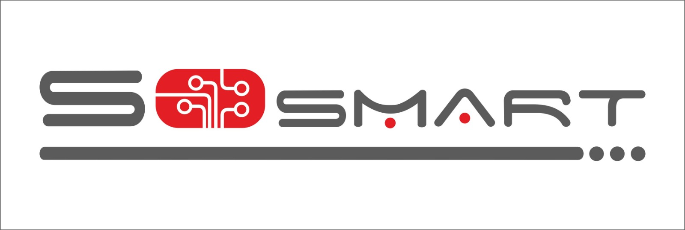

	

# Roboost IDE Kurulum

Proje github repository'den cekilir.

    git clone https://github.com/meridya/Roboost_IDE.git

Proje dosyasında

    cd <proje klasörü>/build

    ant build

ile kodumuz derlenmiş olurç

Çalıştırmak için

    ant run

Ayrıca build klasörünün altında linux, windows ve macos için derleme klasörleri bulunur.